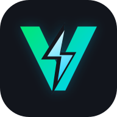

#  VoltFlow

Next.js
React
Supabase
PWA
License

**VoltFlow** is a mobile-first EV charging cockpit for live session tracking, deterministic ETA, energy delivery, tariff-aware cost estimates, and charging history.
**VoltFlow** — мобильная панель для контроля зарядки электромобиля: живые сессии, точный ETA, расчет энергии, стоимость по тарифу и история зарядок.

## **Установить на телефон:** [инструкция для iPhone и Android](INSTALL.md)

Рабочая версия проекта: [https://volt-flow-beige.vercel.app/](https://volt-flow-beige.vercel.app/)

## Language / Язык

- [English](#english)
- [Русский](#русский)

---

## English

### Overview

VoltFlow helps EV drivers model and track AC charging sessions without talking directly to charger hardware. The app anchors every charging session to timestamps in Postgres, then recomputes battery percent, delivered kWh, estimated cost, and remaining time from wall-clock math. That makes refreshes, reconnects, and PWA restores predictable.

### Highlights

- **Live charging cockpit** with battery progress, elapsed time, remaining time, kWh, cost, and AC power.
- **Vehicle profiles** for usable battery capacity, wallbox power, and AC efficiency.
- **Tariff-aware estimates** with local currency preferences: EUR, USD, BYN, and RUB.
- **Supabase Auth + RLS** so users only read and update their own vehicles and sessions.
- **Realtime session sync** through Supabase updates on `charging_sessions`.
- **Installable PWA** with app manifest, service worker, icons, and iOS home-screen support.
- **Mobile-first shell** optimized for thumb-friendly controls and safe-area navigation.
- **Internationalization** for English, Belarusian, and Russian.
- **BYD YUAN UP knowledge base** with Telegram-style guides, FAQ, accessories, spare parts, and admin CMS.
- **Semantic knowledge search** powered by OpenAI embeddings.
- **BYDMate live telemetry** ingestion for vehicle snapshots, history, and trip tracks.
- **Web push notifications** for completed charging sessions when VAPID keys are configured.

### Tech Stack


| Layer              | Technology                                                      |
| ------------------ | --------------------------------------------------------------- |
| Framework          | Next.js 16 App Router                                           |
| UI                 | React 19, Tailwind CSS 4, shadcn-style components, lucide-react |
| State & data       | TanStack Query, Zustand                                         |
| Forms & validation | React Hook Form, Zod                                            |
| Backend            | Supabase Auth, Postgres, Realtime, Row Level Security           |
| PWA                | `manifest.ts`, production service worker, app icons, web push   |
| Deployment target  | Vercel or any Node-compatible Next.js host                      |


### Getting Started

#### Requirements

- Node.js `22.x`
- npm `10.x`
- Supabase project

#### 1. Install dependencies

```bash
npm install
```

#### 2. Configure environment variables

Copy the example file:

```bash
cp .env.example .env.local
```

Set these values:

```bash
NEXT_PUBLIC_SUPABASE_URL=https://your-project.supabase.co
NEXT_PUBLIC_SUPABASE_ANON_KEY=your-anon-key
SUPABASE_SERVICE_ROLE_KEY=your-service-role-key
```

Optional features use these values:

```bash
OPENAI_API_KEY=your-openai-api-key
NEXT_PUBLIC_VAPID_PUBLIC_KEY=your-vapid-public-key
VAPID_PRIVATE_KEY=your-vapid-private-key
VAPID_SUBJECT=mailto:your@email.com
```

The client uses the anon key with RLS. The service role key is used by server-side admin, knowledge search, and BYDMate ingestion flows and should never be exposed to the browser. `OPENAI_API_KEY` enables semantic search indexing/search. VAPID keys enable browser push notifications.

#### 3. Prepare Supabase

Run all migrations in timestamp order from:

```text
supabase/migrations/
```

They create and evolve:

- `profiles`
- `cars`
- `charging_sessions`
- `push_subscriptions`
- knowledge CMS tables for categories, articles, FAQ, accessories, spare parts, and semantic search
- BYDMate telemetry snapshots, samples, trips, and track points
- RLS policies scoped by `auth.uid()`
- profile creation trigger
- `updated_at` trigger
- Realtime publication for `charging_sessions`

In Supabase, also enable Realtime for the `charging_sessions` table, confirm the knowledge image storage buckets from the migrations exist if you plan to manage CMS images, and configure Auth redirect URLs:

```text
http://localhost:3000
https://your-production-domain.com
```

#### 4. Run locally

```bash
npm run dev
```

Open [http://localhost:3000](http://localhost:3000).

### Scripts

```bash
npm run dev       # Start Next.js dev server
npm run build     # Create production build
npm run start     # Start production server
npm run lint      # Run ESLint
```

### Automatic Version Bump

This local clone has a Git `pre-commit` hook at `.git/hooks/pre-commit`.
Every normal commit automatically bumps the patch version in `package.json`
and `package-lock.json`, then stages those files into the same commit.

Example:

```text
0.1.4 -> 0.1.5
```

The hook is local to this machine because `.git/hooks` is not committed to the
repository. If the hook ever needs to be recreated, add this file:

```sh
#!/bin/sh
set -e

node <<'NODE'
const fs = require("fs");
const path = require("path");

const root = process.cwd();
const packagePath = path.join(root, "package.json");
const lockPath = path.join(root, "package-lock.json");

function readJson(filePath) {
  return JSON.parse(fs.readFileSync(filePath, "utf8"));
}

function writeJson(filePath, data) {
  fs.writeFileSync(filePath, `${JSON.stringify(data, null, 2)}\n`);
}

function bumpPatch(version) {
  const match = /^(\d+)\.(\d+)\.(\d+)(.*)$/.exec(version);

  if (!match) {
    throw new Error(`Unsupported package version: ${version}`);
  }

  return `${match[1]}.${match[2]}.${Number(match[3]) + 1}${match[4] || ""}`;
}

const packageJson = readJson(packagePath);
const nextVersion = bumpPatch(packageJson.version);

packageJson.version = nextVersion;
writeJson(packagePath, packageJson);

if (fs.existsSync(lockPath)) {
  const lockJson = readJson(lockPath);

  if (typeof lockJson.version === "string") {
    lockJson.version = nextVersion;
  }

  if (lockJson.packages && lockJson.packages[""]) {
    lockJson.packages[""].version = nextVersion;
  }

  writeJson(lockPath, lockJson);
}

console.log(`Version bumped to ${nextVersion}`);
NODE

git add package.json package-lock.json
```

Then make it executable:

```bash
chmod +x .git/hooks/pre-commit
```

### Charging Model

VoltFlow stores immutable session inputs such as starting percent, target percent, battery capacity, charger power, efficiency, tariff, and timestamps. Runtime values are recomputed from `started_at` plus the current wall clock:

- current battery percent
- delivered AC energy
- estimated cost
- ETA and remaining duration
- completed or stopped state

Those values are persisted back to Postgres so browser refreshes, realtime subscribers, and restored PWA sessions stay consistent.

### PWA Development

- App manifest: `src/app/manifest.ts`
- Service worker: `public/sw.js`
- Registration component: `src/components/sw-register.tsx`
- SVG brand assets: `public/voltflow-icon.svg`, `public/voltflow-logo.svg`
- PNG icons: `public/icon-192.png`, `public/icon-512.png`, `public/apple-touch-icon.png`
- Start URL: `/telegram`
- Display mode: `standalone`

The service worker is registered only in production builds, so test installability with:

```bash
npm run build
npm run start
```

Then open the deployed domain or local production server in the browser.

User-facing install instructions live in [INSTALL.md](INSTALL.md).

### Project Structure

```text
src/app/                 Routes, layouts, manifest, auth callback
src/actions/             Server actions for cars and sessions
src/components/          UI, brand, dashboard, charging, history, settings
src/hooks/               Query, session, translation, and ticking-clock hooks
src/lib/                 Charging math, i18n, Supabase clients, utilities
src/stores/              Local UI and preference stores
src/types/               Database types
supabase/migrations/     Database schema, RLS, triggers, Realtime setup
public/                  PWA icons, service worker, brand assets
```

### Brand

- Base: `#12151C`
- Card: `#171B24`
- Border: `#273040`
- Text: `#F8FAFC`
- Primary green: `#00E676`
- Cyan: `#00D1FF`
- Accent blue: `#2962FF`
- Typography: Space Grotesk with Inter/system fallback

### License

MIT License. See [LICENSE](LICENSE).

---

## Русский

### Обзор

VoltFlow помогает владельцам электромобилей моделировать и отслеживать AC-зарядку без прямого подключения к зарядной станции. Каждая сессия привязана к временным меткам в Postgres, а процент батареи, переданные кВт·ч, примерная стоимость и оставшееся время пересчитываются по реальному времени. Поэтому обновление страницы, восстановление PWA и повторное подключение остаются предсказуемыми.

### Возможности

- **Живая панель зарядки** с прогрессом батареи, прошедшим временем, ETA, кВт·ч, стоимостью и AC-мощностью.
- **Профили автомобилей** с полезной емкостью батареи, мощностью wallbox и эффективностью AC-зарядки.
- **Расчет стоимости по тарифу** с локальными валютами: EUR, USD, BYN и RUB.
- **Supabase Auth + RLS**, чтобы пользователь видел и менял только свои автомобили и сессии.
- **Realtime-синхронизация** через обновления таблицы `charging_sessions`.
- **Устанавливаемая PWA** с manifest, service worker, иконками и поддержкой iOS Home Screen.
- **Mobile-first интерфейс** с крупными touch-контролами и safe-area навигацией.
- **Локализация** на английский, белорусский и русский языки.
- **База знаний BYD YUAN UP** в Telegram-формате: гайды, FAQ, аксессуары, запчасти и admin CMS.
- **Семантический поиск** по базе знаний через OpenAI embeddings.
- **BYDMate live telemetry** для live-снимков автомобиля, истории и треков поездок.
- **Web push-уведомления** о завершении зарядки, если настроены VAPID-ключи.

### Стек


| Слой               | Технологии                                                      |
| ------------------ | --------------------------------------------------------------- |
| Фреймворк          | Next.js 16 App Router                                           |
| UI                 | React 19, Tailwind CSS 4, shadcn-style компоненты, lucide-react |
| Состояние и данные | TanStack Query, Zustand                                         |
| Формы и валидация  | React Hook Form, Zod                                            |
| Бэкенд             | Supabase Auth, Postgres, Realtime, Row Level Security           |
| PWA                | `manifest.ts`, production service worker, app icons, web push   |
| Деплой             | Vercel или любой Node-compatible хостинг для Next.js            |


### Быстрый старт

#### Требования

- Node.js `22.x`
- npm `10.x`
- проект Supabase

#### 1. Установите зависимости

```bash
npm install
```

#### 2. Настройте переменные окружения

Скопируйте пример:

```bash
cp .env.example .env.local
```

Заполните значения:

```bash
NEXT_PUBLIC_SUPABASE_URL=https://your-project.supabase.co
NEXT_PUBLIC_SUPABASE_ANON_KEY=your-anon-key
SUPABASE_SERVICE_ROLE_KEY=your-service-role-key
```

Опциональные функции используют эти значения:

```bash
OPENAI_API_KEY=your-openai-api-key
NEXT_PUBLIC_VAPID_PUBLIC_KEY=your-vapid-public-key
VAPID_PRIVATE_KEY=your-vapid-private-key
VAPID_SUBJECT=mailto:your@email.com
```

Клиентская часть использует anon key вместе с RLS. Service role key используется серверными admin-, search- и BYDMate-сценариями и не должен попадать в браузер. `OPENAI_API_KEY` включает семантический поиск. VAPID-ключи включают browser push-уведомления.

#### 3. Подготовьте Supabase

Выполните все миграции по порядку timestamp из каталога:

```text
supabase/migrations/
```

Они создают и обновляют:

- `profiles`
- `cars`
- `charging_sessions`
- `push_subscriptions`
- CMS-таблицы базы знаний для разделов, статей, FAQ, аксессуаров, запчастей и семантического поиска
- BYDMate telemetry snapshots, samples, trips и track points
- RLS-политики через `auth.uid()`
- триггер создания профиля
- триггер `updated_at`
- Realtime-публикацию для `charging_sessions`

Также включите Realtime для таблицы `charging_sessions`, проверьте наличие storage buckets из миграций для загрузки изображений из knowledge admin, если планируете управлять CMS-контентом, и добавьте Auth Redirect URLs:

```text
http://localhost:3000
https://your-production-domain.com
```

#### 4. Запустите локально

```bash
npm run dev
```

Откройте [http://localhost:3000](http://localhost:3000).

### Скрипты

```bash
npm run dev       # Запуск Next.js dev server
npm run build     # Production build
npm run start     # Production server
npm run lint      # ESLint
```

### Автоматическое обновление версии

В этом локальном клоне настроен Git `pre-commit` hook:
`.git/hooks/pre-commit`. При каждом обычном коммите он автоматически
увеличивает patch-версию в `package.json` и `package-lock.json`, а затем
добавляет эти файлы в тот же коммит.

Пример:

```text
0.1.4 -> 0.1.5
```

Hook локальный для этой машины, потому что `.git/hooks` не коммитится в
репозиторий. Если его нужно восстановить, используйте инструкцию из английского
раздела Automatic Version Bump и затем выполните:

```bash
chmod +x .git/hooks/pre-commit
```

### Модель зарядки

VoltFlow хранит неизменяемые входные данные сессии: стартовый процент, цель, емкость батареи, мощность зарядки, эффективность, тариф и временные метки. Текущие значения пересчитываются из `started_at` и текущего времени:

- текущий процент батареи
- переданная AC-энергия
- примерная стоимость
- ETA и оставшееся время
- статус завершения или остановки

Эти значения сохраняются обратно в Postgres, поэтому обновление страницы, realtime-подписчики и восстановленная PWA видят согласованное состояние.

### PWA для разработки

- Manifest: `src/app/manifest.ts`
- Service worker: `public/sw.js`
- Регистрация service worker: `src/components/sw-register.tsx`
- SVG-бренд: `public/voltflow-icon.svg`, `public/voltflow-logo.svg`
- PNG-иконки: `public/icon-192.png`, `public/icon-512.png`, `public/apple-touch-icon.png`
- Start URL: `/telegram`
- Display mode: `standalone`

Service worker регистрируется только в production build, поэтому installability проверяйте так:

```bash
npm run build
npm run start
```

Затем откройте production-домен или локальный production server в браузере.

Пользовательская инструкция по установке находится в [INSTALL.md](INSTALL.md).

### Структура проекта

```text
src/app/                 Роуты, layout-файлы, manifest, auth callback
src/actions/             Server actions для автомобилей и сессий
src/components/          UI, бренд, dashboard, charging, history, settings
src/hooks/               Query, session, translation и ticking-clock hooks
src/lib/                 Charging math, i18n, Supabase clients, utilities
src/stores/              Локальные UI и preference stores
src/types/               Типы базы данных
supabase/migrations/     Схема БД, RLS, triggers, Realtime
public/                  PWA icons, service worker, brand assets
```

### Бренд

- Основа: `#12151C`
- Карточки: `#171B24`
- Границы: `#273040`
- Текст: `#F8FAFC`
- Основной зеленый: `#00E676`
- Cyan: `#00D1FF`
- Accent blue: `#2962FF`
- Типографика: Space Grotesk с fallback на Inter/system

### Лицензия

MIT License. Подробности в [LICENSE](LICENSE).
